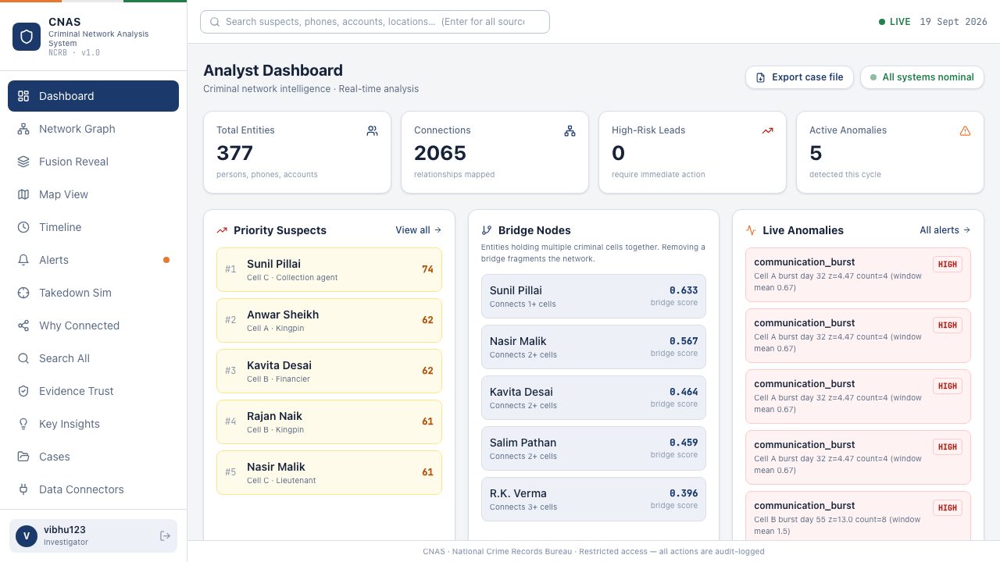
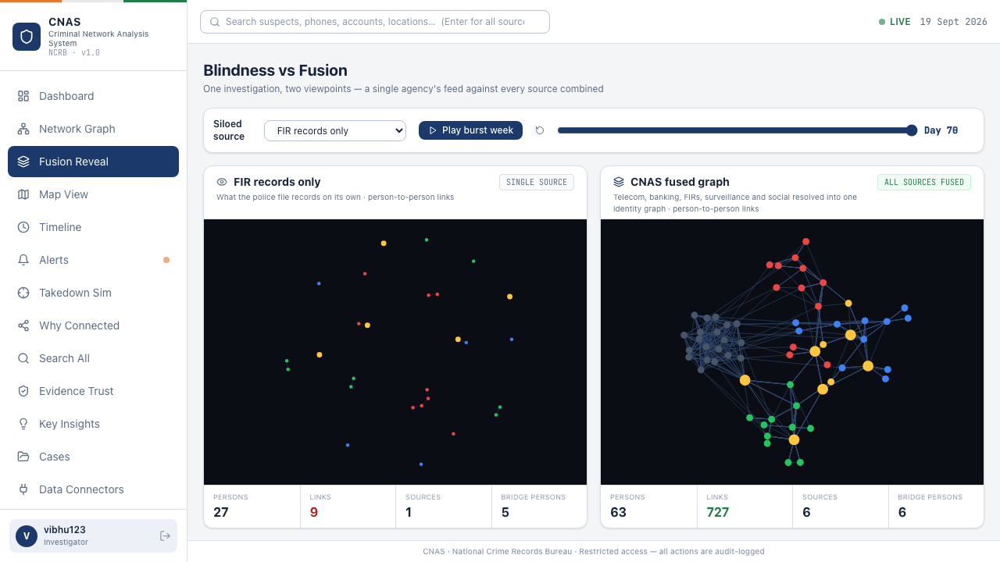
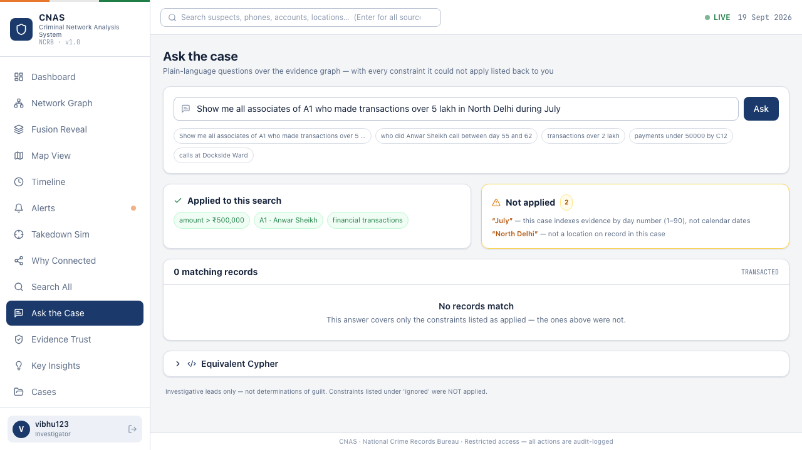
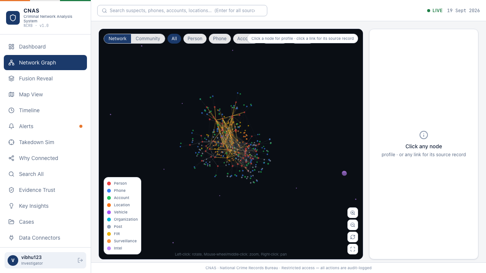
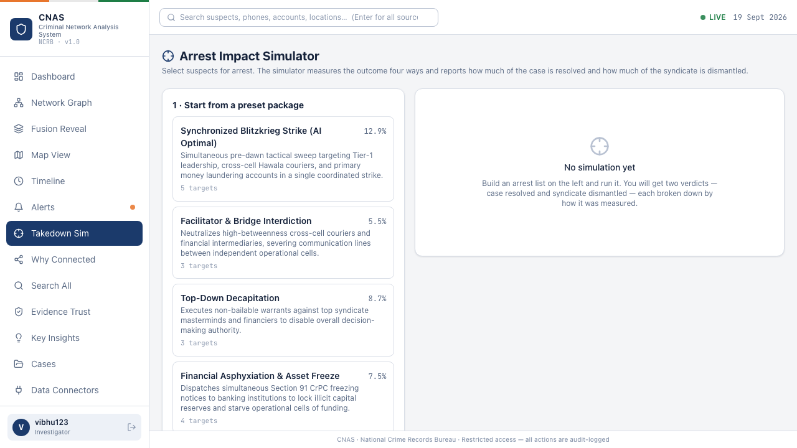
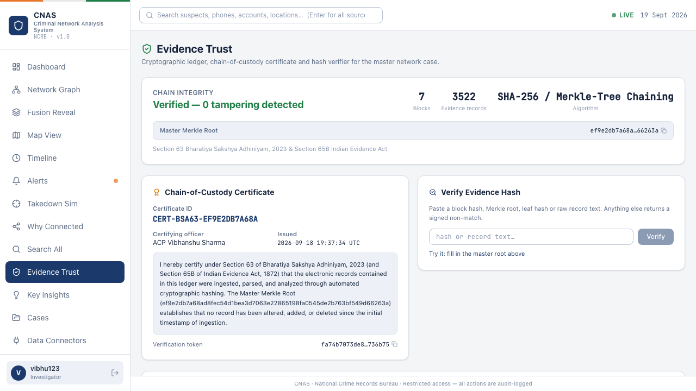
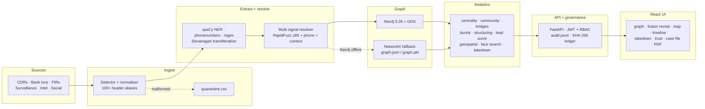

# CNAS — Criminal Network Analysis System

**AI-powered criminal network analysis from fragmented, multi-source police data.**
Smart India Hackathon · Problem Statement **189** · National Crime Records Bureau.

CNAS ingests the records an investigation actually produces — call detail records, bank
transfers, FIR narratives, surveillance logs, intelligence reports, social posts, criminal
history — resolves the same person across all of them, builds one knowledge graph, and tells
an officer **who matters, why, and what happens if you arrest them**. Every figure on screen
traces back to a source record with a SHA-256 hash.



---

## The problem

Across three cells — narcotics, arms, extortion — the people are named almost everywhere.
The structure is not. In this dataset the police file names 27 suspects and yields **9**
relationships between them. Surveillance logs give 7. Social media names 32 people and gives
**zero**. You cannot compute betweenness on a list of names, so the courier holding two cells
together is unrankable no matter how often he is mentioned.

Fusion is what produces the structure, so CNAS puts that argument on screen as a measured
comparison rather than a claim.



The same investigation, twice, from one data pull. Left: a single source, chosen from the
dropdown. Right: every source resolved into one identity graph — 727 relationships, cells in
red/blue/green, bridge entities in gold. One slider drives both panels across the burst week.

Every figure on that screen is counted from the graph, including the single-source bridge
count — which is why selecting telecom honestly shows it already names all 6 bridge persons.
Telecom is the richest single source here; its blind spot is the money trail, not the people.

---

## What it does

**Ingest and normalise**
- 7 upload connectors (CDR, bank, FIR/PDF, intelligence, surveillance, social, criminal history)
- Format auto-detection: 100+ header aliases, delimiter and encoding sniffing (incl. Windows cp1252), Excel workbooks
- Malformed rows quarantined to `output/quarantine.csv` instead of silently dropped

**Extract and resolve identity**
- spaCy NER over free-text narratives, `phonenumbers` for E.164 validation, regex for accounts and vehicle plates
- **Hindi / code-mixed narratives**: Devanagari numerals normalised, names transliterated with schwa deletion, then phonetically folded (v/w, f/ph, q/k, z/j) so `रमेश यादव` resolves to the canonical `Ramesh Yadav`
- Multi-signal entity resolution: RapidFuzz name score + exact phone/account match + address/gang/cell context. Merges at ≥85 name **and** ≥0.65 confidence; 70–85 is logged as a rejected candidate rather than merged

**Analyse**
- Centrality (degree, betweenness, eigenvector, closeness) and Louvain community detection
- Bridge scoring — `0.6 × normalised betweenness + 0.4 × cross-community edge ratio`
- Burst detection — rolling z-score, flagged at z > 2.0, with multi-cell correlation
- Financial structuring — 10+ cash transactions under ₹50,000 to one receiver inside 12 days
- Lead scoring (0–100, CRITICAL/HIGH/MEDIUM/LOW), cross-case linking, geospatial trajectories and hotspots, facial similarity search

**Ask**
- Plain-language questions over the graph — subject, relationship, amount, place and day window are parsed deterministically offline, no model and no API key
- Every answer carries **what was applied and what was not**. A narrow answer and a wrong answer are indistinguishable unless the system shows its reading of the question
- Results cite source record IDs and evidence hashes; the equivalent parameterised Cypher is shown for when Neo4j is attached



Asked for transactions "in North Delhi during July", it applies the three constraints it
understands and refuses the two it cannot: North Delhi is not a location on record, and this
case indexes evidence by day number rather than calendar dates. The honest answer inside those
constraints is zero records — A1's neighbourhood holds 17 transactions, none above ₹2.85 lakh.

**Act**
- Arrest impact simulator: four strike packages, network dismantlement %, isolated fragments, freezable assets
- One-click **automated case file PDF** — priority suspects, per-entity evidence basis from `/why`, bridge table, burst table, and the thresholds used, so the document is auditable on its own
- Court-format chain-of-custody certificate (Section 63 BSA 2023 / Section 65B IEA)

**Govern**
- JWT auth with role gating: all three roles (`admin` / `investigator` / `analyst`) can read the graph; writes — entity edits, merges, curation — are restricted to `admin` and `investigator`
- Append-only audit trail: every query logged with user, timestamp and touched entity IDs
- Blockchain-style evidence ledger: SHA-256 per record, chained, Merkle-rooted, verifiable in the UI
- Every screen labels output as investigative leads, never determinations of guilt

| Network graph | Arrest simulator | Evidence trust |
|---|---|---|
|  |  |  |

---

## Architecture



Neo4j is optional. If it is unreachable the pipeline falls back to NetworkX and serialises the
graph to disk, so the demo never depends on a database being up.

---

## Quick start

```bash
# 1. Python deps + spaCy model (the model is not installed by requirements.txt alone)
./scripts/setup.sh

# 2. Build the graph from the bundled synthetic dataset
python3 -m backend.loader --clean
python3 -m backend.graph.builder

# 3. API (from the repo root)
python3 -m uvicorn backend.api.main:app --port 8000

# 4. UI (separate terminal)
cd ui && npm install && npm run dev
```

Open http://localhost:5173. The Vite dev server proxies `/api` to port 8000. Interactive API
docs are at http://localhost:8000/docs.

With Neo4j + GDS instead of the in-memory fallback:

```bash
docker compose up -d      # Neo4j 5.26 + GDS, plus the API container
```

---

## Data

The demo graph is **synthetic** — fictional people, phones (`70000xxxxx`) and accounts
(`AC0009xxxxxx`) generated from a ground-truth network of 43 entities across 3 cells with 4
bridge figures. Ground truth never enters the pipeline; `backend/eval/score.py` reads it
separately to score the output.

`data/_real_samples/` proves the pipeline handles authorized real-world formats rather than
only its own schema: Jio-style CDRs with cp1252 encoding, SBI UTR-format transfers, an English
FIR narrative, a **Hindi FIR narrative**, and a genuine NCRB aggregate table. Upload any of them
through Cases → Upload evidence and watch schema detection map the columns.

Live entity feeds (CCTNS, TRAI, FIU-IND, NATGRID, eCourts, INTERPOL) are modelled in the Data
Connectors panel as authorization-gated. The platform is built; those need agency credentials.

---

## Tests

```bash
python3 -m pytest -q      # 134 tests: pipeline, analytics, API contracts, RBAC, Hindi NLP
cd ui && npx tsc --noEmit # UI typecheck
```

---

## Repo layout

```
backend/
  ingestion/     detector, normaliser, column mapper, per-case store
  extraction/    entity_extractor.py, devanagari.py (Hindi support)
  resolution/    multi-signal entity resolver
  nlq.py         natural-language query parser (bounded, reports what it ignored)
  graph/         Neo4j client, NetworkX builder, analyst overrides
  analytics/     12 engines — centrality, community, bridges, bursts,
                 financial anomaly, lead scoring, cross-case, geospatial,
                 face search, takedown simulator, blockchain ledger
  api/main.py    FastAPI app — ~80 endpoints, JWT + RBAC + audit
ui/src/
  pages/         18 screens (graph, fusion, map, timeline, takedown, trust…)
  lib/           client-side PDF generation (dossier, case file)
data/            synthetic dataset, real-format samples, mugshots
docs/designs/    design docs and the decisions behind them
tests/           pytest suite
DEMO_RUNBOOK.md  8-minute demo script with failure recovery
```

---

## Scope and limitations

Stated plainly, because an evaluator will ask:

- The demo graph is synthetic micro-data. The pipeline is proven on real *formats*, not on real case records — those require authorized agency access.
- Facial search is a 128-d embedding similarity search, not forensic-grade recognition. It surfaces candidates with confidence bands; it does not identify people.
- Hindi handling is transliteration and gazetteer based (offline, no model download), not a trained Hindi NER model. It resolves names reliably; it does not parse arbitrary Hindi grammar.
- Detection thresholds are fixed and published rather than learned, so every result can be re-derived and challenged. That is a deliberate trade against accuracy.
- Scale today is file-backed per case, with Neo4j wired in for larger graphs.

Everything CNAS outputs is an investigative lead. It does not determine guilt, and the UI says
so on every screen that scores a person.
